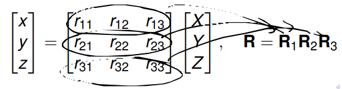
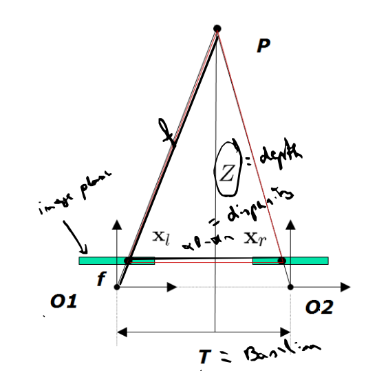
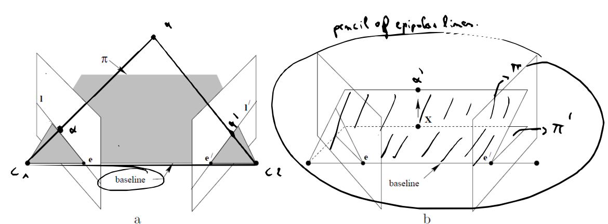
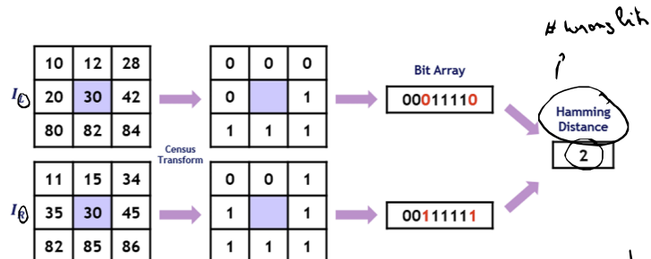
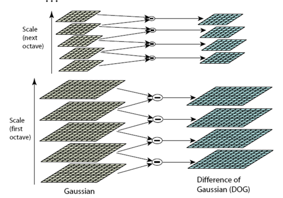

# Chapter 1: Basic Problems Computer Vision

**Structure**:

- **Definition**
- **Problems (what, where, where does it go?)**
- **What: Object Detection/Recognition/Segmentation/Detection&Tracking**
- **Where: 3D Modeling and Reconstruction**:
  - **Stereo**
  - **Visual Hull**
  - **Image Stitching**
  - **View Interpolation**
  - **Pose Estimation**
- **Where does it go?: Motion Analysis**:
  - **FG/BG Segmentation**
  - **Object Tracking based on FG/BG segmentation**
  - **Optical Flow**
  - **Odometry**

> What is computer vision?

Computer vision is the technology which allows us to describe the world through RGB images, videos, point clouds, ...

> What are the most basic problems seen in computer vision?

- **What is the object seen in the image?**
  - **Category recognition**, which is the older version of image classification
  - **Instance recognition**, which allows you to recognize a 2D or 3D object in an other image with a different angle/background/environment.
  - **Object detection**, which usually uses a ground
  - **Segmentation**, where the pixels are grouped together based on characteristics: color, texture, ... and strong boundaries are defined between these groups
    - an interesting usecase of segmentation is called the **grabcut algorithm**: this algorithm predicts the color distribution of the foreground and background and performs binary segmentation
  - **Detection and tracking**:
    1. grabcut algorithm
    2. using multiple camera views
- **Where is the object situated?**:
  - **Stereo**, using two camera views, it can deduct the depth information, allowing for 3D reconstruction of the environment. More is seen in **Chapter 2D**!
  - **Visual Hull**, extracts a 3D object by using multiple camera views of the silhouette
  - **Camera Stitching**, stitches frames with overlapping fields together. Common tools for this are: SIFT/ORB feature detectors/descriptors, Affine/Homographic transformations, RANSAC
  - **View Interpolation**, simply creates an interpolation of two camera views
  - **Pose Estimation**, constructs the pose of an object
- **Where does the object go?**:
  - **FG/BG segmentation**:
    - Define a background model based on previous frames
    - Compare the current frame with the background model
    - Pixels that do not correspond to the background model are labeled as **foreground**
    - Disadvantages:
      - sensitive to noise (moving leafs, ...)
      - illumination changes
      - ...
  - **Object Tracking based on FG/BG segmentation**:
    - The assumption is that the background is very static, which means that the foreground is perceived as dynamic. Thus, perfect for security surveillance
  - **Optical Flow**:
    - Calculates the flow vectors based on the estimation of the displacement of the pixels from the current frame compared to the previous frame.
    - Disadvantages:
      - noise
      - illumination changes
      - ...
  - **Odometry**, which calculates the estimated distance traveled of the camera

# Chapter 2a: Projective Geometry

**Structure**:

- **Homogeneous Coordinates**
- **2D Transformations**
- **3D Transformations**
- **Pinhole Camera Model**
- **2D Homographies**

> Explain what homogeneous coordinates are and why they are useful

Homogeneous coordinates (which are used in a **projective plane**) are coordinates that allow us to get 2D projections of 3D scenes. The main issue with the standard Cartisian coordinates (**Euclidean plane**) is that points/lines in infinity cannot be represented. Homogeneous coordinates will basically replace the concept of parallelism (which is prevailing in cartesian coordinates) with the concept of representing points/lines in infinity. points in infinity are called **ideal points**.
Homogeneous coordinates also simplify a lot of the mathematical operations needed in this subject.

> Explain the operations in the Projective Plane and how to convert Homogeneous coordinates to Cartesian coordinates

So every 2D coordinate is represented by (X, Y, Z), where nothing is zero. Multiplying these coordinates results in the same coordinates ($\lambda X$, $\lambda Y$, $\lambda Z$)
If Z == 0: you get (X, Y, 0), thus point in infinity (ideal point)

To convert from Homogeneous coordinates to Cartesian coordinates we simply divide the coordinates by $Z$, ofcourse only if Z is not zero. So in other words: (X/Z, Y/Z).

> Side note: How to easily switch off a transformation?

In the above image, we see that the left transformation is locked, this is because the 3:3 coordinate is put to 0. This has been made very easy due to using Homogeneous coordinates!

> How do lines work within the Projective Plane?

These are defined by: $aX + bY + cZ = 0$

Same thing is points (we will see later what the duality principle is), we can say that multiplying the coordinates with $\lambda$ is equivalent to the same line.

If Z == 0, then we have a line that intersects with a point in infinity $(b, -a, 0)$

The image above showcases that parallel lines are projected onto a line that intersects with a point in infinity (b, -a, 0).

To get the Cartesian line we simply divide all components by $Z$. Thus you get $aX/Z + bY/Z + c = 0$.

Here we provide a proof that parallelism has been replaced with a line intersecting with a point in infinity, which is (b, -a, 0):

> Define the relationship between a point and a line and the operations that go with this relationship

The relationship is given by: $l^T p = 0$. If this is the case, then the point lies onto the line. Same can be said in reverse due to the duality principle: $p^T l = 0$. Here the line contains the point $p$.

A line can be constructed from two points using:
$l = p1 \times p2$

A **proof** is given here:

Again, due to the duality principle we can say that a point can be constructed from two lines intersecting! ($p = l \times m$)

Another way to look at this relationship is by viewing the following image:

Here, we focus on a common point (origin) shooting out two rays onto the image plane. This constructs a plane, where if we define $l$ to be $l = p1 \times p2$ we get the plane normal. The reverse can be said due to the duality principle:

A custom visualization is given here:

> Explain the Duality principle

This principles states that operations applied on lines are equally correct on points. For example:

- $l = p1 \times p2$ > $p = l \times m$
- $l^T p = 0$ -> $p^t l = 0$
- ...

> Explain briefly what we do in 3D situations

A homogeneous coordinate is now defined as:

$(X, Y, Z, W)$, of which the Cartesian coordinate is then $(X/W, Y/W, Z/W)$.

Instead of lines, we talk about planes here.

> Explain all 2D transformations and compare with the 3D transformations

**hint**: ESAP (Euclidean, Similarity, Affine, Projective (homography)) and LAPC (length, angles, parallelism, collinearity)

**Side note**: zooming in on the 2D Homography, which uses a 3x3 matrix using 8 DOFs, we mention that we must need atleast 4 matching points inorder to execute the transformation. This is because every matching point generates 2 constraints and thus 8 equations are formed, which can be used to solve the 8 unknowns.

**hint**: TESAP (Translation, Euclidean, Similarity, Affine, Projective (homography)) and OLAPC (orientation, length, angles, parallelism, collinearity)

With the 3D transformations, all non-projective matrices are 3x4. If the transformation only includes rotations, we can even use a 3x3 matrix.

And if you must combine multiple types of transformations, we can use a 4x4 composite transformation matrix. NOTE, it is always possible to work with 4x4 matrices.

> Explain how rotations work in 3D transformations

So essentially all rotations within 3D transformations are done by convolution around an axis $\hat{n}$

All rotations can be combined into one rotation around a specific axis $\hat{n}$ These are **NOT** commutative!

What about the **calculations**?
Well you can use the Rodriguez formula:
$
\mathbf{R}(\hat{n}, \theta) = \mathbf{I} + \sin\theta \ [\hat{n}]_\times + (1 - \cos\theta) \ [\hat{n}]_\times^2
$

As seen in the formula, we use $[\hat{n}]_\times$. This is the **anti-symmetrical matrix**:

An example exercise is given below:

> Explain the relationship between camera coordinates vs world coordinates

Example of going from **camera coordinates** to **world coordinates**:

So now that the transformation matrix has been calculated, you can start transforming:

However, lets now go from world to camera coordinates, we need the inverse of the transformation matrix for this. Main idea: use negative translation and transform with the rotation matrix using the negative rotation. Combine both matrixes and voila you have your inverse, this is way more optimized than recalculating the whole thing in practice.

Now we can multiply this matrix with a world coordinate and get the camera coordinates!

> Draw a pinhole model and explain how to relate the 2D coordinates on the image plain with the real world object coordinates

For finding the relationship, we can draw something like this:

This results in the following relationship:

However, we don't like the Z coordinate, so let's get rid of it and note this differently:

We managed to put Z into $\lambda$ which we don't have to care about.
Now we get a solid relationship, where $K_f$ is defined as the calibration matrix specifically for the focal length:

This is good enough if the camera principal axis is alligned with the Z-axis.
If not, we must use a full projective matrix, containing calibration matrix and rotation/translation:

In this case, this is for a spherical lens (f, 10 dof) (if non-spherical -> fx, fy, 11 dof). The Projective matrix $P$ is a 3x4.

> Explain briefly what the calibration matrix does and is

The calibration matrix is defined by $K$:

Where f = focal length
s = skew (mostly 0)
px, py = principal coordinates (mostly 0)

These allow you to convert the image coordinates to pixel coordinates!

> Full conversion exercise

> Explain what 2D Homographies are, how to find these, and what they are used for

First of all, 2D homographies are based on planer objects, meaning the object must be in a plane, defined by: $Z = aX + bY + c$

They are defined by:

How can we find these? Well, each matching pair gives 2 constraints:

- $v_1^T h = 0$
- $v_2^T h = 0$

Since we know that a 2D homography has 8 DOF's, we can find the solution of the homography with 4 matching point pairs. We can then use SVD and find the LS solution.

To get higher accuracies, we must use more than 4 point pairs, decompose using SVD to find LS solution.

2D homographies are used to straighten the perspective.

Now as mentioned earlier, this depends on the assumption that we work in a plane. If there are two planes, we need two homographies etc. When these is no real plane, we must use the depth information to find the homography.

> How can we find and calculate point pairs automatically?

1. Use key descriptors/detectors like SIFT or ORB to find potential candidates
2. Then we use RANSAC to find the best pairs (you can choose how many, again, atleast 4)

# Chapter 2b: Camera Calibration

**Structure**:

- **Singular Value Decomposition (SVD)**
- **Least Square Minimization**
- **Camera Calibration from known 3D points**
- **Multiplane Calibration**
- **Lens Distortion**

> Explain what Range, Nullspace and Rank are

Let $A$ be a $m\times n$ matrix

**Range**:

- All vectors where $Ax = b$
- Subspace of $\mathbb{R}^m$

**Nullspace**:

- Make distinction between right nullspace and left nullspace ($Ax = 0$ and $xA = 0$)
- Subspace of $\mathbb{R}^n$

**Rank**:

- Dimension of Range
- Rank <= min(m, n)

Side note: These can be extracted from the decomposition when using SVD as well.

> Explain what orthogonal matrices are

These are matrices that adhere to the following properties:

- $AA^T = A^TA = 1$
- $A^{-1} = A^T$
- $det(A) = +- 1$

It is a dominant trait, meaning, when multiplying two orthogonal matrices you get a orthogonal matrix.

An interesting matrix, the rotation matrix, is an actual orthogonal matrix, their $det(A) = + 1$

> SVD, explain what this results in and what the properties are of the components

SVD, singular value decomposition can decompose a matrix $A$ which is $m\times n $ into the following (this is always true):

$A = UDV^T$

- $U$, $m\times m$ matrix, orthogonal, provides **orthonormal** base of **Range** $A$
- $D$, $m\times n$ matrix, hold the signular values (usually descending order), they dictate which columns build the nullspace and range of $V$ and $U$
- $V$, $n\times n$ matrix, orthogonal, provides **orthonormal** base of **nullspace** $A$

Example is given below:

Here the first 2 columns of $U$ define the range of A, as $\sigma_1$ and $\sigma_2$ are non-zero.
$\sigma_3$ is zero, meaning the third column of $V$ defines the nullspace

> Describe what LS is (Least Squares)

It is the strategy used in **overdetermined** systems, essentially there a more equations than unknowns. (m >>> n)

It is used in:

- fundamental matrix
- essential matrix
- finding homography
- fit a curve
- ...

> Explain how LS actually works in both cases: 1) m!=n 2) m = n

**$m!=n$**

You want to minimize the following equation:
$\| Ax - b \| $

We will do that by simply deducing what $x$ needs to be to get the equation as close as possible to zero!
Lets delve deeper in this:

$\| Ax - b \| = \| UDV^Tx - b \|$
since that U is **orthogonal** we know that we can just move it around without harm:
$\| DV^Tx - U^Tb \|$, lets define it as: $\| Dy - b' \|$

When looking at this simplified equation we now see that if $y_i = b_i/d_i$ that we get a minimization
So $Vx = y$ is the solution here.

Thus $\| Ax - b \| $ is minimized by saying that $x = VD'U^Tb$

where $D'$ is $D^T$ where the elements are $1/d_i$

**$m=n$**

If this is the case, it comes down to defining $x$ as $A^{-1}b$

> Simple exercise

Answer: $x = v_n$, with $v_n$ being the last column of V from the decomposition

Why?

> LS Example

This example is typical for image stabilization, correction of lens distortion

In this case we have 9 matching pairs, meaning 18 equations, where only 6 unknowns (due to affine transo). This is obviously an overdetermined system (m > n) meaning we can find the solution by minimizing $\| Ax - b \|$ by defining $x = VD'U^Tb$. Ok now knowing this, decompose $A$:

D has no zero values for singular values, meaning there is no nullspace.

**What would happen if all the red points would lie on a common line?**

- The transformation would simply fail, not be as stable.
- Also no depth information!

To find minimized x, we need $D'$, it looks like this:

Ok putting everything together we get our transformation matrix (Affine transformation) to map the green points on to the blue points:

Same thing is used for typical 2D Homographies:

$\lambda x = H x$

Obviously, in these exercises, it was totally assumed that the point matches have already been found. In practice, to find these you must use **feature descriptors/descriptions** + **RANSAC** to find the best matching points.

> What are the advantages/disadvantages from finding the Projective matrix using known 3D points, and extrapolating it to finding the intrinsic and extrinsic parameters?

- Advantage:
  - simple
- Disadvantages:
  - no correction for lens distortion
  - position of 3D point not always accurate
  - Minimizes algebraic error, not geometric error

(**Spoiler**, Zhang's method is way better!)

> How can we find the Projective matrix when knowing the 3D points?

We know what the (x, X) points are, thus we need to extract P from the following:

$x = P X$

// The reason for this is because we want to calculate the calibration and the potential rotation and translation matrices

As before, we simply want to use SVD and then find the LS minimal solution, so:

- $\lambda x = P X$
- this produces 2 constraints per matching point pair
- for N points we now get $Ap = 0$, where $A$ is a $2N \times 12$ matrix and $p$ needs to be minimized, which if you remember is very similar to an exercise we made: \*\*minimize $Ax=0$ with $\|x\|=1$, where the solution is $x = v_n$. In this case it is the exact same situation.

> When the P is known, how do we extract the instrinsic parameters and the extrinsic parameters (again, the 3D points are indeed known)?

As we know already, P consists of K and (R|t), thus, simulate P as:

$P = (H|h)$ where $H=K*R$ and $h = K * t$.

- $K$ and $R$ are found through the QR decomposition: $H^{-1} = AB$ where A is orthogonal and B is upper triangular matrix (K is also an upper triangular matrix ;))

- Do the calculations: $H = B^{-1} A^{-1}$, but because A is orthogonal => $H = B^{-1} A^T$
- From this we can deduce that $K = B^{-1}$ and $R = A^T$ and $t = K^{-1} h$

> Whats the difference between calibration using known 3D points and using multiplane calibration (Zhang)?

**Usage 3D points**:

- Advantage:
  - Simple
- Disadvantage:
  - Algebraic error is minimized, not geometric error
  - Hard to be accurate with 3D points
  - Does not model lens distortion

**Usage of multiplane calibration**:

- Can be extended to find lens distortion correction coefficients
- Can find all 5 calibration parameters (fx, fy, s, px, py)
- Only need a planar object with known features (chessboard)

> How does the Zhang's method work?

**High level**:

- Finding H, this must atleast be done 3 times
- We get 6 equations for 6 unknowns
- We use the Cholesky Decomposition to extract K
- Mission complete :)

1. Find H

We start of at $\lambda x = P X$. Then we choose a world coordinate frame such that Z = 0, essentially we create a planar object.
Now you got the following matrix:

Now that we got H in the formula, we can estimate it by defining 4 points at least, using SVD to find LS solution!
Once we $H$, we can find K through the **Cholesky decomposition**:

We model our Homography to the following: $H = (h1, h2, h3) = K (r1, r2, t)$
Knowing this we can define:

- $r1 = K^{-1} h_1$
- $r2 = K^{-1} h_2$
- $t = K^{-1} h_3$

Orthonormale constraints voor $r_1$ and $r_2$ are:

- $r_1^{T}r_2 = 0$
- $\|r_1\| = \|r_2\| = 1$

This allows us to write the following:

- $h_1^TK^{-T}K^{-1} h_2 = 0$
- $h_1^TK^{-T}K^{-1} h_1 - h_2^TK^{-T}K^{-1} h_2 = 0$

When defining $B = K^{-T}K^{-1}$ -> cholesky symmetric matrix (causing there to be 6 unknowns instead of 9)
we get:

- $h_1^TK h_2 = 0$
- $h_1^TK h_1 - h_2^TK h_2 = 0$

So essentially, every homography now produces 2 constraints, meaning you need 3 homographies (3 chessboards in different angles with other words lol) to calculate the calibration matrix.

For some visualization:

> How does Zhang allow for camera pose estimation?

$r_1 = K^{-1}h_1$

$r_2 = K^{-1}h_2$

$r_3 = r_1 \times r_2$

$t = K^{-1} h_3$

Hence the relationship between the camera frame and the chessboard coordinate frame is the typical:

For the second camera, this is:

The two frames are related through:

This is what we call **pairwise calibration**. We get all the intrinics, camera poses.

> What can be done for Camera Calibration in larger scenes?

Dimensions of large objects are usually known (football fields, ...)
We can still extract the calibration values from K using Zhang's method.
However, for the extrinsic parameters we use the known 3D coordinates method, meaning we must deduce it from $P$: $K^{-1}P = (R|t)$

> What about lens distortion, how is it modeled and how are the coefficients calculated?

**radial distortion** is commonly modeled as:

$$
\begin{align*}
x'_c &= x_c \left(1 + \kappa_1 r_c^2 + \kappa_2 r_c^4 \right) \\
y'_c &= y_c \left(1 + \kappa_1 r_c^2 + \kappa_2 r_c^4 \right)
\end{align*}
$$

Where $x_c$ and $y_c$ are the optical center coordinates
$\kappa$ being the distortion coefficients and $r_c$ being the radial distance to the optical center ($x_c$ and $y_c$)

if n >> 1 point pair, you can calculate $\kappa_1$ and $\kappa_2$ using SVD and LS
In all cases however, multiplane calibration (Zhang) allows to calculate $\kappa_1$, $\kappa_2$, ${x_c}$ and ${y_c}$.

**Always first distortion correct as this has effect on other operations!**

# Chapter 2c: Epipolar Geometry

**Structure**:

- **Disparity and depth**
- **Epipolar geometry**
- **Fundamental Matrix**
- **Essential Matrix**:
- **Camera Pose estimation from E**

> Explain the canonical stereo configuration

Note: It is assumed that the camera configurations for both cameras are identical

The depth is extracted using $Z = \frac{T*f}{disparity}$
In this case, if either baseline $T$ or $f$ increase, the accuracy increases, while talking about disparity, if too large = hard to find point correspondences.

This is used to get the depth map to be able to create a 3D reconstruction of the environment.
However, getting the matching points in this configuration is rather complicated, thus we seek help in **epipolar geometry**.

> Explain the setup of epipolar geometry and what is so advantageous

Here we define a couple of elements:

- epipoles: intersections of the image plane with the baseline
- epipolar line: the line along which we find the corresponding $x'$, passes through $e$
- baseline: is the line connecting both camera centers
- epipolar plane: is the plane between baseline and and the rays made

The most advantegeous thing about epipolar geometry is that we don't have to scan the whole image for a matching x point. We can just scan on the epipolar line $l'$

When X varies, we get a **pencil** of epipolar lines with a common baseline:

> What happens when the image planes are parallel to the baseline

If this happens, the epipolar lines are placed in infinity. This simplifies the matching process as we only have to look in the horizontal row of both images, the epipolar lines are essentially horizontal.

> What happens with the epipoles when the camera is moving forward?

The epipoles lie on the line inwhich the camera is moving

> Give the relationship between the epipolar lines and the Fundamental matrix

The relationship between the epipolar lines and the fundamental matrix is given by:

$x^{'T}Fx = 0$

Here $x^{'T}F$ defines the coefficients of the $l$ and $Fx$ defines the coefficients of $l'$
F is a $3\times 3$ matrix, with rank 2, meaning the D has $\sigma_1$ and $\sigma_2$ set to non-zero values.
F has 7 degrees of freedom.

> How can we find the epipoles using the fundamental matrix?

$Fe = 0$ and $F^T e'= 0$

Proof:

We define two epipolar lines:

$x_1^{T}Fe = 0$
$x_2^{T}Fe = 0$

**e** must be on both lines as the rule of the epipolar line is to intersect with the epipolars.

$x_1^{T}Fe - x_1^{T}Fe = 0$
$(x_1^{T} - x_2^{T})Fe = 0$

Essentially showing that there is a common $e$.

> Give proof that the fundamental matrix exists

Define epipolar plane which does not pass through the camera centers.

Independent of how the plane was chosen:

- $x'$ and $e'$ define the epipolar line of $x$
- this means we can define a homography between $x'$ and $x$: $x' = H x$

We know from previous chapters that the line joining $x'$ and $e'$ is $x'\times e'$.
We also know that $x' = H x$, thus $e'\times Hx' = Fx$

With other words, F is the crossproduct of the epipolar $e'$ and the Homography itself.
However, a lot of the times $H$ and $e'$ are not known.

> How to calculate the fundamental matrix?

1. **eight-point-algorithm**

- Use many matching points (n >>> 8)
- use SVD to find LS solution of F
- to make sure F is rank 2, decompose using SVD and set the third singular value to 0 and recompose.

Details:

We start of at defining the relation between F and epipolar line:
$x'^TFx=0$, this gives 1 constraint. We get a system like so: $Af = 0$. We must find the LS solution of this, where we define a constraint $\|f\| = 1$, that way we only have 8 unknowns, meaning we need atleast 8 matching points for the 8 point algorithm.

2. **Using projection matrices**

Using projection matrices, we can compute the $F$:

$F = e' \times P'P+$

Where $P=UDV^T$ and $P_+ = VD'U^T$

> Explain why the F must be rank 2

When the third singular value of D (decomposed from F) is not zero, the epipolar lines will not form a **pencil** passing through the epipole.

When we do fix it by decomposing F, putting third singular value to zero and recomposing, there should be some fixes:

- rank is 2
- gives unique positions for the two epipoles
- all epipolar lines are passing through the epipole, forming a solid pencil

> Explain why trying to find the LS of $Af=0$ is not usually advised and the solution for this issue

Well, the main reason is that A contains a lot of singular values which are almost 0

this is because the x and y coordinates are usually way larger than z

the solution is to translate and rescale the images (normalized 8-point-algorithm):

- $\hat{x} = Tx$
- $\hat{x'} = T'x'$

So that the origin is at the centroid of selected points
and the distance from origin to points = $\sqrt{2}$

> What is the effect of knowing K (calibration matrix)?

- focal length
- pixel size
- position in space of the image point: $K^{-1}x_i$
- $\theta$ between two image points
- we can compute the normalizated coordinates: $\hat{x}$ using the $K=I$

> Explain what normalized cameras are:

These cameras contain a calibration matrix $K = 1$ and their $focalLength = 1$
This is exactly what the essential matrix is, the fundamental matrix but using a normalized camera

> Explain fully what essential matrix is

Basically a fundemental matrix but for normalized cameras

The relationship between F and E is: $E = (K')^TFK$

When looking into the relationship between epipolar lines and the essential matrix, its essentially the same as for the fundamental matrix however it uses normalized coordinates:

$\hat{x'}^TE\hat{x} = 0$

- Again, the rank must be 2
- Both $\sigma_1$ and $\sigma_2$ are equal and usually = 1
- 5 DOF
- Since we work with scaled coordinates, scaling issues do not occur here!

> Explain how we can calculate the essential matrix $E$

1. Derive it from F

This means using the relational formula:
$E = K'^TFK$

2. eight-point-algorithm

- get atleast 8 matching points (n >>> 8)
- use SVD to find the LS solution for E
- decompose E into $UDV^T$
- manipulate the $\sigma_1$ and $\sigma_2$ by changing it to: $\frac{\sigma_1 + \sigma_2}{2}$. Ofcourse, make sure to put $\sigma_3$ to zero. Recompose.

> Describe how we get the camera pose using the essential matrix

The essential matrix describes a simple relationship with the camera pose:
$E = [t]\times R$
which if we convert to F:

So the steps are as follows:

- Calibrate cameras intrinsically (Zhang)
- Find and match features -> Ransac
- Compute the essential matrix
- Decompose matrix into $[t]\times R$

This gives you two possible rotational matrixes:

- $R = UWV^T$
- $R = UW^TV^T$

with W:

Side note: check if det(R) = + 1, if not, correct this!

and one translation matrix.

> Explain what the **cheirality** constraint is

In order to find the correct camera pose from all the different variations we can calculate, we must check the cheirality constraint. Essentially, the reconstructed points must be in front of both two cameras, meaning that these have a positive depth.

> When do we know the absolute distances

When at least one pair of points in the scene is known (height of building in meters for example)

> What three ways are there to calculate the camera pose?

# Chapter 2d: Stereo Vision and Depth Perception

> Explain briefly what rectified stereo matching is

We make the epipolar lines horizontal by rotating , this way we remove the y coordinate, thus improving the stereo matching a lot

> Explain the different types of rotations a camera can make

The most important here is to understand that these rotations are indeed **2D homographies**.

> Explain the ways of calculating a rectification

1. Stereo Pair Rectification

- First find the direction in which to rotate the first camera by computing $optical_{axis} \times baseline$. Then you rotate the camera around the axis until the **optical axis** is perpendicular to the **baseline**. Do this with the smallest possible angle.
- Repeat this for the second camera
- Due to tilt angles might being different, we rotate the second camera around the baseline to allign the optical axes of both first and second cameras
- The epipolar lines are parallel, but not necessarily horizontal. Rotsate the first camera about its optical axis until it's y-axis is perpendicular to the baseline (meaning that the x axis will be parallel to it)
- repeat for second camera
- If the cameras have different intrinsic parameters, we apply a homography $K_1K_2^{-1}$ to the second camera.

2. Using the essential matrix

The following relation holds:

$R = I$ and $t = (T, 0, 0)$

If that's the case, we can define $E = [t]_{\times}R$

where $[t] is the skew-symmetric matrix:

Thus we get $E$ being:

After, we check the constraint: $\hat{x'}^TE\hat{x}= 0$

Indeed the y-coordinate stays the same, meaning the epipolar lines are horizontal!

Ok but how do we put the epipoles to infinity?

- First we need the epipole on the right side:
  $E^Te = 0$
- What about the right side?
  we need to construct a $R_{rect}$

- $r_1 = e_1$
- 
- $r_3 = r_1 \times r_2$

if $r_1 == e_1$ and $r_2$ and $r_3$ are orthogonal then the point is located at x infinity:

**(1, 0, 0)**

> Give me the steps of using essential matrix for stereo rectification

**step 1**: align right camera with left camera using **R**

**step 2**: rotate both cameras such that the epipolar lines are horizontal using $R_{rect}$

**step 3**: compensate for camera intrinsics

In other words:

- Estimate $E$ using the 8-point algorithm
- Decompose $E$ into $R$ and $t$ to build $R_{rect}$ from $t$
- Set homographies: $H_1 = KR_{rect}$ and $H_2 = KRR_{rect}$
- Apply the homographies to left and right camera.

> Give me the similarity measures for stereo matching

First some mentions of traditional similarity measures:

- squared intensity differences (sid)
- absolute intensity differences (aid)
- normalized cross correlation (ncc)
- Sum of hamming distances: (shd)
  
  Robust against intensity variations

> What do Disparity maps show?

Show the horizontal displacements of the pixels

> What are occlusions?

Are artifacts seen on one image and which are not visible on another

> Explain the Disparity Scale Image (DSI)

The horizontal axis describes the image coords and the vertical axis
You can stack these on each other to obtain a cost volume
To find the lowest cost, dynamic programming must be used.

The dynamic programming can be extended using occlusion filling, simply add a cost for the insertion of missing pixels.

> What are the challenges that go with stereo vision

- camera calibration errors
- large baselines
- occlusions
- violations brightness constancy
- low constract, textureless regions

Stereo matching can also be done using Neural Networks, think of **monodepth2**

> Depth can also be extracted from structured light

1. project pattern of vertical strips on object
2. use edge detection to find all edge pixels in image
3. for each edge pixel: construct image ray and find intersection with red plane of edge pixels defined by the projector

> Explain the advantage of Active Stereo

we project a speckle pattern on to the object to obtain texture on the uniform regions (which was a negative of stereo vision)

> Time of flight cameras (ToF)

These measure the time it takes for light to travel to the object and back.
This is done by emitting short pulses

For ToF, we have two types of configurations:

1. Pulsed Methods

Reflected light is measured during two out-of-phase windows

2. Continuous Wave method

Reflected light measured during 4 windows, phase shifted by $\pi / 2$
This is less senstitive to ambient light

> Using ToF cameras, how can we get the camera pose?

1. Using the RGB camera
2. Applying iterative Clostest Point Algorithm (ICP) to the point cloud (collection of measured points) of the depth image

> What types of LIDARs are there (light detection and ranging)

1. Mechanical scanning LIDAR: mechanically moving + collimated laser beam
2. Solid-state flash LIDAR: diverging laser beam in a single pulse + non-moving components

> Give some examples of Active and Passive depth imaging systems

Active: ToF, LIDAR, active stereo, structured light
Passive: stereo, moving cameras, ...

> Give me some other depth cues:

- Plenoptic camera: stereo vision applied on microlens array
- Depth from focus: depth per pixel is related to the plane of focus, however, you need a lot of images
- Depth from defocus: depth can be retrieved by estimating the point spread function (PSF)
- Semantic labeling and high level prios: not generalizable
- Monocular depth estimation using deep learning, often inaccurate though

# Chapter 3a: feature detectors/descriptors: SIFT, ORB, MSER

> What is a keypoint and a keypoint descriptor

Keypoint = an interesting point that can be easily recognized
Keypoint descriptor = bit vector that describes the keypoint and can be used to do keypoint matching

Well known keypoint detectors: SIFT, Harris, SURF, ...
Well known keypoint descriptors: SIFT, BRIEF

> Talk about invariance relation to keypoints

Typically you want your keypoints to be invariant against multiple things like:

Note: RITS

- rotation
- illumination
- translation
- scale

> Explain what the main idea is of SIFT

- SIFT (scale invariant feature transform)
- goal: detect/describe (detector/descriptor) features that are invariant to RIS (rotation, illumination, scale)
- fast version: SURF

Some hyperparams in Opencv:

- nFeatures: number of features to retain
- nOctaveLayers: numbers of layers/octave (3 is proposed)
- constrastThreshold: threshold for filtering out weak features in uniform regions
- edgeThreshold: used to filter edge-like features
- sigma: $\sigma$ of Gaussian applied to first layer (smoothing)

> Explain SIFT's scale space exterma detection

1. Gaussian Pyramid

This allows you to detect features on different scales.
The more layers, the finer the scaling is.

Gaussian smoothing is needed to prevent aliasing when subsampling

2. LoG

SIFT finds local extrema across scale-space of Laplacian of Gaussian (LoG), aka Mexican Hat
These extrema correspons to interesting blobs

3. DoG

To speed up from LoG, we can take the difference of gaussians instead (DoG), which does lose detail
These DoG filters are derived from Gaussian pyramid.

Also the mexican hat here is negative!

> Define what an octave is

It refers to a series of images that are progressively blurred and subsampled versions of the original image.

- The scale is divided into these octaves: $\sigma, 2\sigma, 4\sigma$
- Within each octave: $\sigma_0, 2^{\frac{1}{k}} \sigma_0, 2^{\frac{2}{k}} \sigma_0$
- Subtract subsequent scales to achieve DoG filters
- Each time we change octaves we reset $\sigma$

> Explain how maxima detection works

- Compare each point with:
  - 8 neigbours on current layer
  - 9 neighbours on adjacent layers
- To obtain better localization:
  - locally fit a 3D quadratic function f to data and compute extremum of f.
- Output:
  - localization and the scale of the extramum

> How many scales do we assign per octave?

Lowe describes 3!
The more scales, the more keypoints, however more matching errors!

> How to elmininate weak and edge-like extrema?

- To avoid weak extrema: Use gradient large enough
- To avoid edge-like extrema: Elminiate points where maximum curvature DoG >> minimum curvature DoG

> Explain about keypoint descriptors

Essentially, we create a histogram 4x4 containing image gradients, that represent the magnitude and the direction of the maximum intensity change at each point in the image. These show the main orientation.

To include **rotation** invariance, we rotate these gradients to align all main orientations.

magnitudes are weighted using Gaussian with $\sigma$ corresponding to scale of keypoint

descriptors contain 16 histograms each with 8 bins, thus 128 elements!

> How is image stitching performed using SIFT?

1. Compute keypoints + descriptors
2. compute distances between descriptors of left and right image
3. select best matches
4. Use Ransac to find homography
5. apply homography and blend using gaussian filters

> Explain briefly how object detection can be performed using SIFT (scale invariant feature transform)

Use a reference image:

Then matching keypoints and descriptors are found essentially

> Explain how Fast detectors work

Fast (features from accelerated Segment test) is used to find pixels that are likely to be part of a corner.

How does it work?

$p$ is the candidate pixel. So you have a circle of 16 pixels, if 12 continuous pixels are lighter (or darker) than the candidate, then we got a corner.

To make this algorithm faster, we can first compare pixels 1, 5, 9, 13. atleast 3 of them should statisfy, this allows early rejection of the candidate pixels.

Some remarks:

- if n < 12 then too many keypoints
- will not detect corners that are perfectly alligned with x and y axis, use blurring
- FAST is not scale invariant, apply FAST to image pyramids

> How can Fast be optimized using decision trees?

1. run FAST on a large of set of images and store all ternary vectors of length 16

2. Use ID3 algorithm to find a decision tree that can decide wether aa point is a FAST keypoint such that the number of queries is minimized.

> Why is FAST translation invariant?

Because the corners are decided on the relative brightness. So if the image moves, the relative brightness does not change

> Why is FAST rotation invariant?

It is not really rotation invariant however it can be made invariant by computing the orientation of the corners based on the intensity centroid of the corner.

> Why is FAST robust for illumination changes and camera noise?

Comes from the intensity threshold when deciding wether a pixel is part of a corner or not. The camera noise is due to the fact that everything is seen relatively to each other.

> Explain how BRIEF descriptors work

define $s(p, q) = 1:  I(p) - I(q) > 0 : 0$

Example of brief descriptor is:

$s(p_0, q_0)2^0 + s(p_1, q_1)2^1 + ... $

Some remarks:

There are different approaches in choosing pairs (p, q). The best however, is **random**!

- BRIEF is not scale invariant
- BRIEF is not rotation invariant
- to increase robustness, you can apply Gaussian filters for smoothing using $\sigma$

> What is ORB?

- Combines FAST detector with oriented BRIEF descriptor
- applies FAST to an image pyramid
- adds orientation operator to FAST (to make BRIEF rotation invariant)
- Employs Harris corner filter to remove edge-like keypoints
- Adapts BRIEF point pair set to reduce correlation between tests

> Explain in detail how to setup ORB

1. Find orientation of FAST by Intensity Centroid

Define the moments of a patch:

Find the centroid:

Orientation of a patch
$\theta = arctan2(m_{01}, m_{10})$

2. Rotate all BRIEF pairs by $\theta$ to make BRIEF descriptors rotation invariant. (Steered BRIEF)

However, less information in point pairs thus use a search algorithm to find a set of uncorrelated tests with a large variance: rBRIEF (robust BRIEF). Essentially decorrelating the data

SO now rotate all rBRIEF pairs by $\theta$ to make BRIEF descriptors rotation invariant

> Explain what MSER is

MSER stands for (Maximally Stable Extremal Regions)

These are used to detect blobs. This can be used to improve wide baseline stereo matching and object recognition

The extremal region $Q$ is defined by stating that all $I(p) > I(q)$ or $I(q) > I(p)$

Suppose we have a nested sequence of regions, then $Q_i$ is maximally stable if:

has a local minimum.

> Explain an efficient way of finding MSERs

- First set T to 0
- Increase T and use union-find algorithm to keep track of the connected regions with $I(p) < T$

> Explain what SuperPoint

This is basically SIFT or ORB but using deeplearning techniques.

# Chapter 3b: Harris and its descendants

First we must define the types of components:

- uniform region: nearby patches look similar
- edge: nearby patches along edge look similar
- corner: all nearby patches look different

Ok but how do we actually compare with neighbouring patches?

Take the difference between patch centered at (u, v) and path shifted over (x, y).

Then a whole lot of mathematical fancy things happen, going to a **quadratic form**: $ax^2 + 2bxy + cy^2$

This form allows you to deduct wether it is a corner or not:

So:

- if $\lambda_1$ and $\lambda_2$ are almost 0 -> uniform region
- if $\lambda_1$ is large and $\lambda_2$ is almost 0 -> edge
- if $\lambda_1$ large and $\lambda_2$ as well, we have a **corner**

Now, how do we calculate these eigenvalues?

Harris and Stephens propose:

Where $M_c$ is the Harris cornessness measure. This value is large for corners.

However, we need to define a $k$ for this, to prevent this we can use the alternative:

> Explain the concept of the Moravec corner detector

Assumes local maximum in the corner strengh (smallest S value over all neighbours) represents a corner. However, the operator is not isotropic (edges that are not alligned vertically, horizontally or diagonally also have high values)

> What is non-maximum suppression

This is a threshold for removing non-maximum corner candidates. The higher, the more precision, but less finds.

> Some imagery

we see that $\sigma$ is too large, too much blur essentially.

> Explain the harris-Laplace Detector

This combines Harris corner detector with the Gaussian scale space

The whole point of the harris laplace detector is to identify interest points that are both corners and are localized in scale-space -> they are detectable at multiple scales

It does the second part (localized in scale-space) by finding maxima over multiple scales.

Common scale kernels: $\sigma_l = \sigma_0(\sqrt{2})^k, with k = 0, 1, 2, ...$

Common corner kernels: $\sigma_D = \sigma_l / \sqrt{2}$

We can further optimize scale and location:

1. Find Initial Corners: Use the Harris-Laplace method to detect corners at a certain scale.
2. Optimize Scale: Adjust the scale to find the one where the Laplacian of Gaussian (LoG) is strongest at each corner.
3. Refine Corner Location: Recalculate the exact position of each corner using the Harris method at the new scale.
4. Repeat: Keep adjusting the scale and refining the corner positions until they stabilize and no longer change.

> What is the problem with variation in viewing conditions?

We need invariance for non-isotropic stretch and skew.
This is because, locations slightly differ, scales differ and covered regions differ.

**solution**

Deskewing!

How can we find these deskewing transformations?

1. extend **harris-laplace with anisotropic kernel**
2. use extended HL to find POI with elliptic neighbourhood
3. apply an affine transformation to make neighborhood circular

# Chapter 3c: Edge Detection

> What are the steps in finding the edges in an image?

1. Apply Gaussian filter at scale $\sigma$
   The larger the kernel the blurrier, same thing for $\sigma$
2. Apply Sobel Operators to find gradient ($G_x$, $G_y$)
   These gradients can measure the rate of change in intensity in the horiznontal and vertical directions which can indicate the presence of edges.

   

3. Derive the edge strenght from gradients $\sqrt{G_x^2 + G_y^2}$

4. Thinning: non-maximum suppression along direction of gradient
5. Thresholding with hysteresis
   Necessary to differentiate between strong, weak and non-edges

> Explain what non-maximum suppression is

Thinning along the direction of the gradient edge strength at p and q is found by interpolation.

Some implementations use the following, which means there is no interpolation needed:

> Explain how canny edge detection uses hysteris for thresholding

You have two thresholds: $T_{strong}, T_{weak}$

- pixel with edge strenght > $T_{strong}$ is always part of an edge
- pixel with edge strength < $T_{weak}$ is never part of an edge
- When inbetween, it becomes strong if it has a neighbour who is strong.

> How are the thresholds defined?

Using the OTSU method, you want to find thresholds that minimize intra-class variance:

This is equivalent to maximizing the inter-class variance:

$\sigma_b$ is much easier to calculate than $\sigma_w$

Some convenient thresholds for OTSU are:

$T_{strong}$ = Otsu's threshold
$T_{weak}$ = 0.5 \* $T_{strong}$

> Some imagery

The higher $\sigma$ the more blur on the edges

The higher $\sigma$ the more thinning is happening

> What are some improvements in canny edge detection?

- Use an adaptive filter, to prevent smoothing of edges
- Other gradients filters can be used, like the 5x5 Sobel filter
- Thinning of edges can result in multi-point responses per edge. Applying morphology can meet the single response per edge criterion
